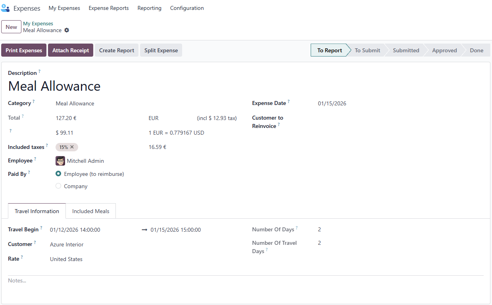
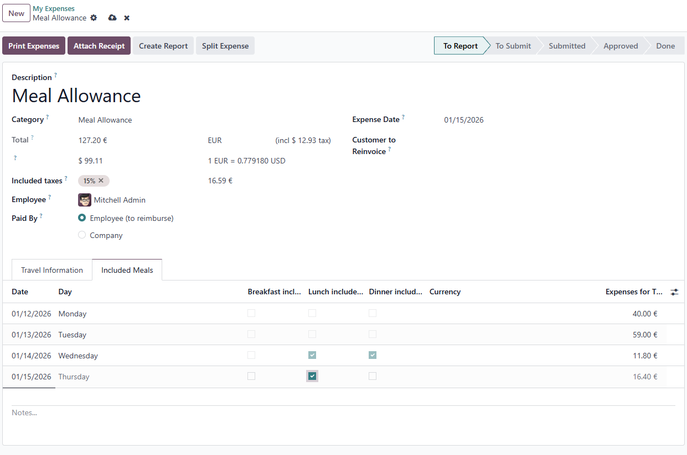
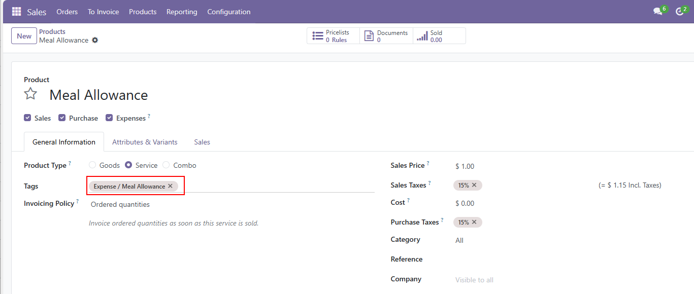
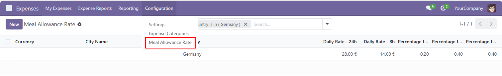

Adds German "Verpflegungsmehraufwände" processing in the expense module.

When a meal allowance product is selected, the UI is changed as following.

The product tag controls whether the Product is of type meal allowance and controls the UI.  

The rates are imported by a csv file. When a rate changes for a certain country, create a new csv line and set the expire_on date on the existing line.
